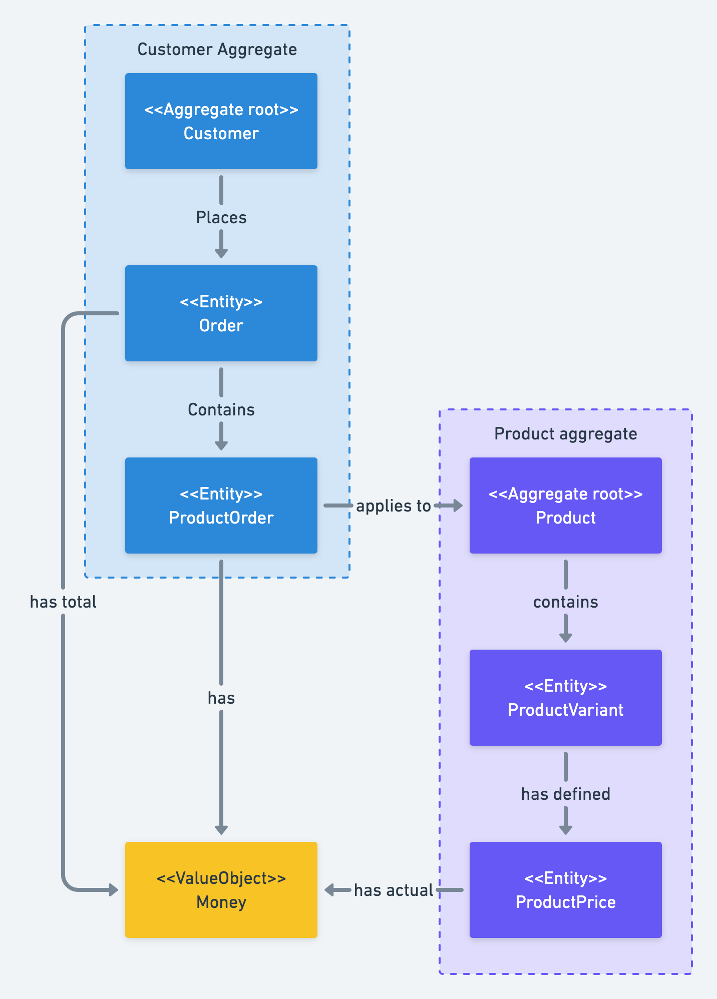

Sample Symfony REST API CQRS implementation with API Platform and DDD using Clean Architecture
==============================================================

## Architecture [Clean Architecture](http://blog.cleancoder.com/uncle-bob/2012/08/13/the-clean-architecture.html)

## CQRS

Read Model - executing SQL scripts on database views objects (using [Doctrine Query Builder](https://www.doctrine-project.org/projects/doctrine-orm/en/2.7/reference/query-builder.html)).

Write Model - Domain Driven Design approach (using Doctrine ORM).

Commands/Queries/Domain Events handling using [Symfony messenger](https://symfony.com/doc/current/components/messenger.html) library.

## [WiP] Domain

## [WiP] Validation

## [WiP] Caching

## Frameworks and libraries

### Frameworks
[Symfony](https://symfony.com/)

[API Platform](https://api-platform.com/)

[Doctrine ORM](https://www.doctrine-project.org/index.html)

### Libraries
[Ramsey UUID for supporting UUIDs](https://github.com/ramsey/uuid-doctrine)

[PHPStan for static analysis](https://github.com/phpstan/phpstan)

[Symfony Messenger for main CQRS bus and Domain bus](https://symfony.com/doc/current/components/messenger.html)

[Symfony Workflow for handling domain states](https://symfony.com/doc/current/components/workflow.html)

[Webmozart Asserts for domain validation](https://github.com/webmozart/assert)

## [WiP] Integration

## Inspired by
[Sample .NET Core CQRS API](https://github.com/kgrzybek/sample-dotnet-core-cqrs-api)

[Symfony 5 DDD CQRS](https://github.com/jorge07/symfony-5-es-cqrs-boilerplate)

[API Platform CQRS ES](https://github.com/jon-ht/api-platform-cqrs-es)

## [WiP] How to run application

## [WiP] How to run Tests

